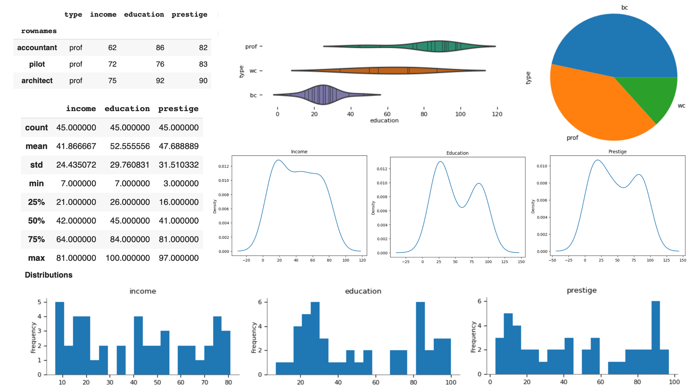

<!-- footer : '' -->
## Fondamenti di Analisi dei Dati 2023/2024
### What is Data Analysis?
#### Prof. Antonino Furnari
http://antoninofurnari.it
University of Catania
Dept. of Maths and Computer Science


---
<!-- footer : 'Fondamenti di Analisi dei Dati 2023/2024 - Prof. Antonino Furnari' -->
# What is Data Analysis?
The goal of this first lecture is to give an understanding of what data analysis is. We will initially keep a rather informal tone, while more formal definition will be given later in the course. 

Before diving into what Data Analysis is, we need to develop at least an intuitive understanding of what data is, which is addressed in the following sections.

---

# What is Data? An informal Definition
We will start by giving an informal definition of data:

>Data is a **set of values** **collected** with respect to some **variables** which describe a given **phenomenon**.

In the definition above, we mentioned some key concepts, which are discussed in the following sections.

---

## Set of Values
When we deal with data, we actually deal with *multiple instances* of values associated to the same event or phenomenon. Examples:

<style scoped>
table {
  font-size: 20px;
}
</style>

|Example|Comment|
|-|-|
|We want to study how the heights of students change with the years| We need sets of recorded heights, not just one height|
|We want to study how a given drug affects the recovering from a disease | We need to record sets of values about drug assumption and recover, just one case will not be enough|
|We need to create a system which can generate text from a prompt | We need to record several examples of prompt-text generation, just one would not be enough to study how such generation should be made|

Since we deal with sets of values, we will often use the term **dataset** to refer to a given collection of data related to a given phenomenon.

---

## Data collection
Data is always collected in some way, hence it may contain errors. Popular ways to collect data include:

<style scoped>
table {
  font-size: 20px;
  width:100%;
}
</style>


|Collection method|Description|Source of error|
|-|-|-|
|Surveys|Asking questions to people|External factors, people may lie|
|Physical measurements | Physically measuring the heights of people | Flawed tools, limited precision.|

In any case, **data will be imperfect**. We often say that we **observe** data and refer to a given value we deal with as an **observation**. 

For instance, the height of a single person in the classroom can be called an observation.

---

## Variables
The values we collect are associated to abstract entities which we will call "variables". 

For the moment, consider that these entities are **similar to the mathematical variables** we are used to or to the variables we encounter in many **programming languages**. 

We could see them as "containers" for the data, but also, and more importantly, as **abstract entities defining which data they are expected to hold**. 

---

### Example - Mathematical Variables
To **compute the area of a triangle**, we may define:
* a variable $h$ to "contain" the value of the height of the triangle;
* a variable $b$ to hold the value for the base. 

$$a=\frac{b\cdot h}{2}$$

defines a variable $a$ to "hold" the value of the area. We can assign different values to $b$ and $h$ to different triangles, but we always expect $b$, $h$ and $a$ to contain the base, the height, and the area. 

---

### Example - Programming Variables
If we create a computer program to solve the same problem, we can define three double variables with the same names and expect them to always contain values **coherent with the ones we had in mind** when we defined such variabiles:

```c
double b;
double h;
double a;

input(&b, &h);

a = (b*h)/2;
```
---


### Example - Statistical Variables
* When analyzing data, **we will define variables expected to contain values related to a specific event or phenomenon**. 
* For instance, we may define a **statistical variable** $H$ to contain the value of the height of people in the class. 
* We may define a variable $W$ to contain the weight of people.
* When we have more than one variable related to different aspects of the same event we will say that the set of values related to the given variables is **an observation**. 

---

### Example - Statistical Variables/Data Points
* The pair of values $(H,W)=(175cm, 68Kg)$ can be seen as an observation. 
* Since this pair of values can be represented as a point in a 2D space, we also call it a **data point**. 
* In this context, a set of observations (e.g., heights and weights of 30 people) is generally called a **dataset**.

---
### Example - Statistical Variables/Data Points
<style scoped>
    img {
        margin-right: 10px;
        display:block;
        float:left;
    }
</style>


|Subject|Height (cm)|Weight (Kg)|
|-|-|-|
|1|175|70|
|2|160|60|
|3|180|78|
|4|160|75|
|5|155|58|
|6|190|110|

---

## Phenomenon
* When we analyze data, we are usually interested in **investigating some phenomenon**. 
* For instance, we may be curious of **what is the rate of overweight students in a school**. 
* This can be useful, e.g., to understand whether a new diet proposed in the school canteen is generating good or bad consequences. 
* The phenomenon we want to study is important to keep in mind when collecting and analyzing data, as an inappropriate data collection could create some bias or make our conclusions limited. 
---

## An example of a dataset
Datasets are usually stored in tables in which **columns represent the different variables** and **rows represent the different observations**:

<style scoped>
table {
  font-size: 25px;
  width:100%;
}
</style>

||Maths | Geography | English | Physics | Chemistry |
|-|-|-|-|-|-|
|x001|8|9|30|8|10|
|x038|9|7|27|6||
|x002|6|-1|18|5|6|
|x012|7|7|25|4|10|
|x042|10|10|30|10|10|

---
<style scoped>
table {
  font-size: 25px;
  width:100%;
}
</style>

||Maths | Geography | English | Physics | Chemistry |
|-|-|-|-|-|-|
|x001|8|9|30|8|10|
|x038|9|7|27|6||
|x002|6|-1|18|5|6|
|x012|7|7|25|4|10|
|x042|10|10|30|10|10|

* Each row is an **observation** related to a given student.
* Each column represents a different **variable**.
* Some values (e.g., `x038` for `Chemistry`) may be missing, others (-1) mistaken.

---
<style scoped>
table {
  font-size: 23px;
  width:100%;
}
</style>

||Maths | Geography | English | Physics | Chemistry |
|-|-|-|-|-|-|
|x001|8|9|30|8|10|
|x038|9|7|27|6||
|x002|6|-1|18|5|6|
|x012|7|7|25|4|10|
|x042|10|10|30|10|10|


Simple data analysis examples:
|Data Analysis|Goal|
|-|-|
|Average (by row) marks obtained by students | Rank students to understand who needs help| 
|Average (by column) votes obtained in each course| Find "difficult" courses|
|Group courses into humanity-based and science-based| Identify students excelling in a field|

---

# A Definition of Data Analysis
We will look at an informal definition of Data Analysis, adapted from wikipedia (https://en.wikipedia.org/wiki/Data_analysis):

>Data analysis is the **process** of inspecting, cleaning, transforming, and modeling data with the goal of **understanding** something about a given phenomenon, supporting **decision-making**, and **making predictions on unseen data**.

While this definition is not very formal, it is a good starting point to get an understanding of what data analysis is. 

---

## Data Analysis as a Process

Data analysis is a process based on a series of techniques:
* **Inspecting**: looking at the data to assess its main properties (number of observations, columns, range, etc.);
* **Cleaning**: «fixing» some aspects of the data (information incorrectly recorded, out of range values);
* **Transforming**: transforming the data from a format to another one (e.g., changing the scale of given columns);
* **Modeling**: tuning a model which can be used to summarize, explain or make predictions about the data.

---

## Goals of Data Analysis
We can simplify by saying that data analysis processes can aim to address three main types of goals:

* Understanding something about a given phenomenon;
* Supporting decision-making;
* Making predictions on unseen data.

We'll see some examples of each of these goals in the following sections.

---

#### Understanding Something About a Given Phenomenon

<style scoped>
    img {
        height: 440px;
        float: left;
        margin-right: 10px;
    }
</style>

 

Darwin conceived the theory of evolution by observing specimens of finches collected in the Galapagos Island.

While he did not use modern data analysis techniques, his conclusions were informed by the observation of data collected in his travels.

---

### Supporting Decision-Making
Data analysis can be also be used to support decision making. 

* A company manufactures three products A, B and C in three geographic locations X, Y, Z. 
* The company has to reduce the production and wants to cut down one of the three products.
* We can use data analysis to choose where to reduce production or which product to discard to minimize loss.
* Some data analysis techniques could also allow to make some simulations of what could happen once the decision is made.

---

### Making Predictions on Unseen Data
Data analysis allows to make prediction of unseen data:

* A bank which wants to develop an algorithm capable of understanding whether a given transaction is a legitimate one or a fraud attempt. 
* The bank already has a team which reviews the some of the transactions to check if they are legitimate. 
* By analyzing past past observations of transactions paired with a variable telling us which of those turned out to be a fraud attempt, we can create a **predictive algorithm** to detect fraud.

---

## Main Types of Data Analysis
While different categorizations are possible, we will consider the following main types of data analysis:

* Descriptive analysis;
* Exploratory analysis;
* Inferential analysis;
* Causal analysis;
* Predictive analysis;
* Time series analysis.

---

### Descriptive Analysis
<style scoped>
    img {
        height:450px;
        float:left;
        margin-right: 20px;
    }
</style>

---

The goal of descriptive analysis is to provide a series of numbers or visualization of the data that describe their main characteristics. 

---

### Exploratory Analysis
<style scoped>
    img {
        height:450px;
        float:left;
        margin-right: 20px;
    }
</style>


Exploratory analysis examines the structure of the data to find problems, make initial hypotheses, understand if data is good for our analysis.

---

### Inferential Analysis
<style scoped>
    img {
        height:450px;
        float:left;
        margin-right: 20px;
    }
</style>


Aims to formally check whether some feature of pattern that we are observing in our dataset is actually likely to be true outside of the dataset at hand. 

---

### Causal Analysis
<style scoped>
    img {
        height:450px;
        float:left;
        margin-right: 20px;
    }
</style>


Causal analysis provides a series of mathematical tools to determine if a causal effect between two events exist, beyond what we simply observe in the data.

---

### Predictive Analysis

<style scoped>
table {
  font-size: 20px;
  float:left;
  margin-right:50px;
}
</style>

|relwt|glufast|glutest|instest|sspg|group|
|---|---|---|---|---|---|
|1\.06|96|465|237|111|Chemical|
|1\.09|110|426|117|118|Normal|
|0\.93|93|472|285|194|???|
|0\.92|300|1468|28|455|Overt|
|0\.88|99|376|134|80|Normal|
|1\.1|107|403|267|254|Normal|
|0\.98|130|670|44|167|???|
|1\.13|92|476|433|226|Chemical|
|1\.0|102|378|165|117|Normal|
|0\.96|78|290|136|142|???|

* Predictive analysis aims to create models able to predict some unobserved features in data which may be available in the future. 
* For instance, we can predict if a subject is likely to become diabetic based on some measurements to screen patients who are at risk.

We can predict "group" from the other variables.

---

### Time Series Analysis
<style scoped>
    img {
        height:450px;
        float:left;
        margin-right: 20px;
    }
</style>


* Time series analysis aims to analyze series of data points s to uncover patterns, trends, seasonality, and other characteristics of the data and to make forecasts based on historical data. 

---

# Data Analysis Workflow
<style scoped>
    li {
        font-size: smaller;
    }
</style>
Typical data analysis workflow:
1. Define your data analysis question
2. Collect the data needed to answer the data analysis question
3. Clean and format the data
3. Explore and describe the data
4. Choose suitable models for the analysis
5. Fit, fine-tune, evaluate, and compare the models for the considered data analysis
6. Review the data analysis when new data is available

---

## Define your data analysis question
We can see data analysis as the process of answering a question.

<style scoped>
    li {
        font-size: smaller;
    }
</style>

* In the example above on the theory of evolution, Darwin tried to answer the question "do species appear as an adaptation to features of the environment?"
* A causal analysis may try to answer a question such as "does consuming too much sugar causes diabetes?" 
* A predictive analysis answer questions of the kind "What is the probability that this subject will develop diabetes?". 

Defining your data analysis question is the very first step of the data analysis process. 

---

## Collect the data needed to answer the data analysis question

* In this stage, we will collect the data we need to answer the data analysis question. 
* There are different ways to collect data for analysis.
* If we want to assess whether consuming too much sugar can cause diabetes, we could look for surveys already made on the topic, or we could set a study in which we go around and ask people what are their eating habits.

---

## Clean and format the data
* The collected data does not always come in a "clean" form. 
* We could have **missing data**. For instance, we may ask for age, but some subjects may refuse to tell us which is their age. 
* In other cases, we may have **incorrect data**, i.e., "strange" numbers probably due to errors in data collection. For instance, if we find an age of 156 years, that may just be a typo and the intended age was just 56 years. 

In this stage, we will use a set of techniques to "fix" these problems in order to filter or clean the data.

---

## Explore and describe the data
* This step consists in exploring the data to make sure that it can be used to answer the question. 
* For instance, we may want to check if the data has been collected properly to answer our question, if it is of sufficient quantity and quality. 
* We will also start to see informally if the question we choose can be plausibly answered with this data.
* Descriptive and exploratory data analysis techniques are used in this stage.

---

## Choose suitable models for the analysis
* In this stage, we will select a set of models which seem to be suitable for answering our question. 
* For instance, if we want to assess if we can predict whether a give subject will develop diabetes, we could choose **classification** models (more on this later in the course). If we want to check for a cause-effect mechanism will may need a different model. 
* The choice of the specific classification/causal inference model will also be based on our understanding of the data (e.g., is the problem multi-dimensional? do we have enough data? etc.).

---

## Fit, fine-tune, evaluate, and compare the models for the considered data analysis
* In this stage, we fit the chosen models to the data. 
* After fitting them, we will need to evaluate how well they model the data. 
* In many cases, we will fit more than one model and compare them to decide which of them is the most appropriate.

---

## Interpret the results
* Once models have been built, we need to interpret our results in order to answer our question. 
* For instance, we may observe a causal relationship between consuming sugars and developing diabetes, but we still need to interpret this result to get an understanding of why and how this happens.

---

## Communicate your results
* This stage is concerned with communicating the results of our analysis in an most accurate and understandable way. 
* The way in which we communicate may depend on the specific audience we are talking to. 
* We will use an informal language if the audience is general and non-technical, or a more technical one if we are writing the results of our analysis in a research paper.

---

## Review the data analysis when new data is available
* At some point, new data may be available. 
* In this stage, we should revise our analysis and update our question, answer, or choice of models.

---
## Non-Linear Workflow

<style scoped>
    img {
        height:450px;
        float: left;
        margin-right: 10px;
    }
</style>


A good data analysis will iterate over the different steps and possibly jump back to any of those steps to revise it. 

For instance, after fitting the models on the data in step 5, one may note that some other models could give better results, and jump back to step 4 to refine the choice of the models, to then return to step 5.

---
## Example
Problem: Analyzing customer reviews to improve product quality and customer satisfaction;
1. Define the data analysis question  "What are the common themes and issues in customer reviews, and how can we address them to improve product quality and satisfaction?" (**step 1 - define your data analysis question**)
2. Collect a dataset of customer reviews from the company's website, social media, and third-party review platforms (**step 2 - collect the data needed**). 

---
## Example (2)

3. Data cleaning and formatting to remove spelling errors, duplicate reviews, and inconsistent formatting (**step 3 - clean and format the data**). 
4. After cleaning the data, the analyst explores and describes it using techniques like word clouds, frequency distributions, and sentiment analysis to uncover common words, sentiments, and trends within the reviews (**step 4 - explore and describe the data**).
5. To extract more meaningful insights from the text data, the analyst decides to apply natural language processing (NLP) techniques (**step 5 - choose suitable models for analysis**). 

---
## Example (3)
6. Upon reviewing the results, the analyst realizes that some topics are unclear and overlapping (**step 6 - fit, fine-tune, evaluate, and compare the models**).
7. The analyst decides to backtrack to the data exploration step (**step 4 - explore and describe the data**) to gain a deeper understanding of the customer feedback. 
8. Customers mention product quality issues when discussing customer service experiences, leading to topic overlap. The analyst categorizes reviews into "product-related" and "service-related" (**step 5 - choose suitable models for analysis**).
 
---
## Example (4)

9. With the revised approach, the analyst proceeds to categorize reviews and analyze them separately (**step 6 - Fit, fine-tune, evaluate, and compare the models for the considered data analysis**). 
10. This results in more interpretable topics, such as "defective products," "timely shipping," and "responsive customer support." The analyst then analyzes these topics to generate actionable insights for product improvement and customer service enhancements.

---
## Example (5)
11. To ensure continuous improvement, the analyst commits to ongoing review and monitoring (**step 7 - Review the data analysis when new data is available**) of customer reviews, periodically updating the analysis to identify new emerging issues or trends. 
12. This iterative approach to data analysis allows for refining strategies and addressing evolving customer concerns over time.

---

# Examples of Data Analysis
Before concluding this introduction, we will analyze and discuss three notable examples of data analysis:
* a **good** example in which data analysis can be used to make decisions and save lives; 
* a **bad** example in which data analysis has been intentionally used to lie and deceive; 
* an **ugly** example in which data analysis has probably been performed in a technical correct, but unethical way.

---

## The Good: Stopping the Spread of Cholera

<style scoped>
    img {
        height: 450px;
        float: left;
        margin-right: 35px;
    }
</style>


* In the 19th century, a common belief was that cholera pandemics was caused by "miasma", particles in the air carrying the disease. 
* This was justified by the observation that pandemics tended to be localized - people getting the disease lived in the same neighborhood.

---

# You Know Nothing Jon Snow

<style scoped>
    img {
        height: 450px;
        float: left;
        margin-right: 35px;
    }
</style>


* In 1854, John Snow, an English doctor, hypothesized that pandemics were due to the contamination of water with the contents of the sewer's system.
* Snow was skeptical of the miasma theory and, hypothesized that cholera was spread by some contaminating agent in the water.
* He published hist theory in 1849, but miasma remained the prevailing theory.

---

# The Ghost Map

<style scoped>
    img {
        height: 450px;
        float: left;
        margin-right: 40px;
    }
</style>


* When a severe outbreak of cholera started in Broad Street in London, John Snow analyzed the deaths due to cholera and put them on a dot distribution map.
* To collect, the data, John Snow interviewed local residents with the help of Reverend Henry Whitehead.

---

## The Ghost Map

<style scoped>
    img {
        height: 450px;
        float: left;
        margin-right: 40px;
        object-fit: none;
    }
</style>


* In the map, bars represented the deaths, while circles represented the positions of public water pumps. 
* At the time, people did not have water in their homes, hence they had to get water from water pumps. 
* Jown Snow noted that for places with more deaths, the closest pump was located in Broad Street.

---
# Removing the Pump Handle
<style scoped>
    img {
        height: 450px;
        float: left;
        margin-right: 40px;
        object-fit: none;
    }
</style>


* Based on this evidence, John Snow convinced the authorities to remove the handle of the pump, hence forcing people to take water from somewhere else. 
* John Snow noted a drastic reduction in the number of deaths in the subsequent days. 
* He concluded that the pipes in Broad Street were contaminated with sewage.
* A replica of the pump was placed in 1992.

---

## The Bad: Proving Nonexistent Links Between MMR Vaccines and Autism

* In 1998, Andrew Wakefield and twelve coauthors published a paper entitled "Ileal-lymphoid-nodular hyperplasia, non-specific colitis, and pervasive developmental disorder in children" in The Lancet. 
* The paper claimed the existence of a causative link between the MMR vaccine and colitis and between colitis and autism.
* Several studies (at least 20) tried to replicate  Wakefield's study and where not able to show any link between vaccine and autism.

---
## The Fraudulent Study
<style scoped>
    img {
        height: 480px;
        float: left;
        margin-right: 40px;
    }
</style>


* Based on 12 carefully selected children.
* Wakefield had been paid by lawyers involved in lawsuits against immunization manufacturers and was applying for a new vaccine patent.
* In 2004, 10 of the 13 authors retracted their support for the MMR-autism association.
* Britain’s General Medical Council investigation found Wakefield guilty of dishonesty and irresponsibility. The lancet retracted the paper in 2010.

---

## Long-Term Effects of the Fraud
<style scoped>
    img {
        height: 480px;
        float: left;
        margin-right: 40px;
    }
</style>


The paper had a profound impact on the rate of immunizations which decreased dramatically, with increased risks for children. 

---

### The Ugly: Manipulating Voters with Stolen Data - The Facebook-Cambridge Analytica Scandal

<style scoped>
    img {
        height: 390px;
        float: left;
        margin-right: 50px;
    }
</style>


* Cambridge Analytica (founded 2013) was a company claiming expertise in psychographic profiling, a method that categorizes individuals based on their psychological traits and behaviors.
* Thanks to the Facebook app "This Is Your Digital Life", a personality quiz, they obtained profiles from around 87 million Facebook users.

---
### The Ugly: Manipulating Voters with Stolen Data - The Facebook-Cambridge Analytica Scandal

<style scoped>
    img {
        height: 390px;
        float: left;
        margin-right: 50px;
    }
</style>


* Based on this data, Cambridge Analytica employed data analysis techniques to construct detailed psychological profiles of individuals using the Big Five personality traits model.
* This enabled them to tailor political messages and advertisements to specific personality types.

---
### The Ugly: Manipulating Voters with Stolen Data - The Facebook-Cambridge Analytica Scandal

As Alexander Nix, the chief executive of Cambridge Analytica claimed:

> Today in the United States we have somewhere close to four or five thousand data points on every individual ... So we model the personality of every adult across the United States, some 230 million people.

(Source https://en.wikipedia.org/wiki/Cambridge_Analytica)

---
### The Ugly: Manipulating Voters with Stolen Data - The Facebook-Cambridge Analytica Scandal

* The unethical aspect of Cambridge Analytica's actions lay in their misuse of personal data obtained without proper consent. 
* Involvement in political campaigns raised concerns about manipulation of democratic processes through propaganda.
* The scandal erupted into the public eye in 2018, when investigations exposed Cambridge Analytica's practices. 
* The story of the Cambridge Analytica scandal is a good example of the risks associated with unethical data practices.


---

# What's Data Analysis Used For Today
<style scoped>
    li {
        font-size: smaller;
    }
</style>
Examples of contexts in which data analysis is useful:
* Healthcare
* Retail and E-Commerce
* Financial Services
* Transportation and Logistics
* Social Media and Digital Marketing
* Process Optimization
* Fault Detection and Predictive Maintenance
* Energy Grid Optimization
---

## Healthcare
* Data analysis in healthcare can enable insights that can improve patient outcomes and optimize operations. 
* Predictive analysis can be used to identify patients at high risk of developing specific diseases, allowing healthcare providers to intervene early with preventive measures. 
* Analyzing electronic health records and medical imaging data can aid in diagnosing diseases and  developing personalized treatment plans.

---

## Retail and E-commerce
* Companies like Amazon utilize data from customer browsing behavior, purchase history, and demographic information to create personalized product recommendations. 
* By analyzing customer data, retailers can optimize pricing strategies, manage inventory more effectively, and forecast demand. 
* Sentiment analysis of customer reviews and social media data can provide valuable insights into consumer preferences and help improve product development and marketing campaigns.

---

## Financial Services
* Banks and credit card companies employ data analytics to identify fraudulent transactions by analyzing patterns, anomalies, and behavioral data. 
* Risk models that analyze historical data and market trends are used to assess creditworthiness and make lending decisions. 
* Algorithmic trading leverages complex data analysis techniques to identify market trends and make high-speed trading decisions.

---
## Transportation and Logistics
* Ride-sharing platforms like Uber and Lyft leverage data analysis to match drivers with riders efficiently and minimize wait times. 
* Logistics companies employ route optimization algorithms to minimize fuel consumption and reduce delivery times. 
* Real-time data analysis of traffic patterns and weather conditions helps improve route planning and avoid delays.

---

## Social Media and Digital Marketing
* Companies analyze user engagement metrics, demographic data, and social media trends to understand customer behavior and tailor marketing strategies. 
* A/B testing is used to compare the effectiveness of different marketing campaigns. 
* Social media sentiment analysis enables businesses to gauge public opinion, manage brand reputation, and identify emerging trends.

---

## Process Optimization
* By analyzing data on manufacturing process (equipment logs, performance metrics), engineers can identify patterns, correlations, and anomalies that can lead to process optimization. 
* For instance, data analysis can be used to identify parameters that significantly impact chip yield and quality. 
* By analyzing historical data, engineers can uncover trends and relationships between process variables and chip performance. 
* This information can then be used to optimize process settings, reduce defects, and improve overall chip quality.

---

## Fault Detection and Predictive Maintenance
* By analyzing sensor data from production equipment, anomalies or deviations from normal operating conditions can be identified in real-time. 
* Through predictive maintenance, engineers can leverage data analysis to detect early signs of equipment degradation or impending failures. 
* By analyzing historical maintenance records and equipment sensor data, patterns can be identified to predict when maintenance is required. 

---

## Solar Energy Optimization
* Solar farms and rooftop solar installations can generate large amounts of data, including solar irradiance levels, weather patterns, system performance metrics, and energy production data. 
* This information can be used to optimize the positioning of solar panels, adjust tilt angles, and improve maintenance schedules. 
* Data analysis can also help predict energy generation and optimize energy storage systems, ensuring maximum utilization of solar resources.

---

## Energy Grid Optimization
* By analyzing real-time data on energy generation, consumption, and grid conditions, operators can identify potential issues, manage grid stability, and improve energy flow. 
* Data analysis techniques, such as machine learning algorithms, can be applied to detect anomalies, predict grid congestion, and optimize grid operation. 
* This enables grid operators to proactively address challenges, integrate renewable energy sources efficiently, and enhance the overall reliability and resilience of the energy grid.

---

# Philosophy of the Course
* Data analysis is a complex process involving different theoretical concepts with roots in theoretical fields such as that of statistics. 
* While it is **fundamental** to understand the theory, we will opt for a formal, but practical introduction of these concepts. 
* We will introduce and describe models, but we will not delve into optimization details or demonstrate theoretical guarantees.
* We will rely on libraries to use the models and techniques introduced in the course, but also aim to form a deep and formal understanding of how a given algorithm works. 

---

## Practical Data Analysis with Python
Data analysis is a skill which is best learnt with practice.
* We will use the Python programming language and different Python libraries explicitly designed to perform data analyses. 
* Another popular choice for data analysis is the R software. Both options (Python and R) are valid but the two packages follow different approaches.
* We will use Python, which is a general purpose programming language, with several extensions for scientific computation and data analysis. 

---

## A Map of the Course
The course will develop through the following macro-units:

1. **Descriptive and exploratory analysis**. We put both analyses types in the same unit as the tools for these two kinds of analysis are sometimes shared, even if their objectives are distinct. 
2. **Inferential analysis**. We will see what are the main tools to make sure that any conclusion we are drawing on the data will likely apply beyond the data that we are analyzing.

---
## A Map of the Course

3. **Causal analysis**. Here we aim to identify the main pitfalls in causal analysis so that we can be aware of which mistakes we can incur in. We will also see some simple approaches which may be sufficient in some cases to perform a proper causal analysis.
4. **Predictive analysis**. We will discuss the philosophy of the approach, which is rather different from the different kinds of analysis seen above, revisit some of the algorithms discussed in the previous sections and see some powerful predictive algorithms which can be applied for data analysis. 

---

## A Map of the Course
5. **Time series analysis**. We will provide an introduction to the analysis of time series, highlighting the main concepts and techniques.

During our journey, we will both focus on theoretical concepts and apply them in practice in real examples of data analyses. This will be done through frequent short laboratory sessions (in the order of one per lecture) showing how to use the introduced concepts in practice, and lectures dedicated to the applications of the discussed concepts in real data analyses.
